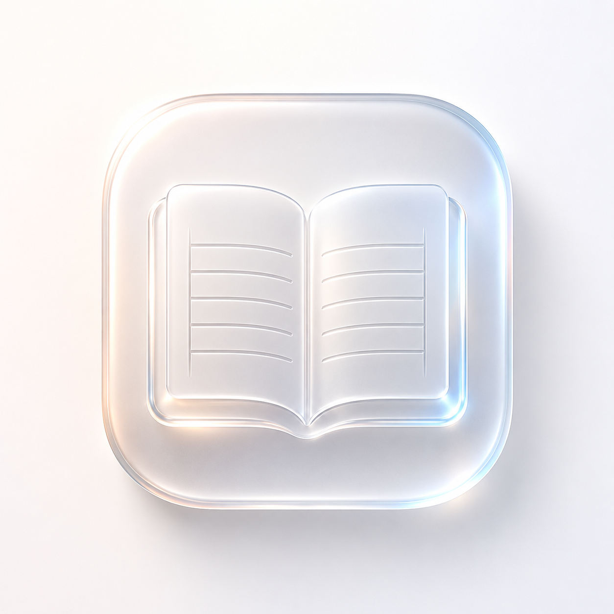

<div align="center">



# 📖 SpendIt

### *The Smyth-Sewn Archival Ledger & Hand-Stitched Financial Folio*

[](https://github.com/onenonlyaman/spendit/releases)
[](https://github.com/onenonlyaman/spendit/actions/workflows/release.yml)
[](https://tauri.app)
[](https://reactjs.org)
[](https://motion.dev)
[](https://sqlite.org)
[](https://tailwindcss.com)
[](LICENSE)

<br />

**SpendIt** bridges the tactile warmth of a physical paper financial journal with modern Apple-inspired glassmorphism, spring physics micro-interactions, and double-entry computational rigor.

[Download Desktop & Android](https://github.com/onenonlyaman/spendit/releases) • [New UI Highlights](#-the-new-ui--design-evolution) • [Feature Tour](#-feature-tour) • [Keyboard Shortcuts](#-keyboard-power-navigation) • [Developer Manual](docs/DEVELOPMENT.md)

</div>

---

<!-- HERO SHOWCASE PLACEHOLDER -->
<div align="center">
  <kbd>
    <h2>🏛️ SpendIt 1.1 Liquid Glass Interface</h2><p><em>[Hero Screenshot / Video Demo Placeholder — Translucent Glassmorphism, Ambient Orbs, and Daily Journal]</em></p></div>'" />
  </kbd>
  <p><em>Reimagined with Apple-grade frosted glass surfaces, ambient atmospheric lighting, and fluid motion physics.</em></p>
</div>

---

## 🎨 The New UI & Design Evolution

SpendIt v1.1.0 introduces a major visual overhaul—fusing the timeless warmth of Smyth-sewn archival stationery with modern liquid glass aesthetics and fluid gestural physics:

- 🪟 **Liquid Glass & Frosted Surfaces (`GlassSurface`)**: Translucent backdrop blur cards with chromatic dispersion and specular highlights that respond naturally to ambient lighting.
- 🌌 **Atmospheric Ambient Light Meshes**: Soft luminous orbs dynamically cast daylight warmth in Ivory light mode and subtle deep glow across true OLED obsidian dark mode.
- 🌊 **Fluid Motion & Directional Spring Transitions**: Powered by `motion`, navigating between folio leaves features physics-based slide transitions, tactile card expansions, and springy press feedback (`whileTap`).
- 🖱️ **Artisanal Custom Context Menu**: Right-click anywhere on desktop for instant power actions (Quick Log, Privacy Toggle, Jump to Today, Export Ledger, Navigation).
- 📱 **Mobile-First Floating Glass Dock**: Optimized for thumb navigation on mobile and tablet screens with adaptive tab expansion and instant search.
- ⚡ **Adaptive Performance Mode**: One-tap toggle that optimizes blurs and animations for low-power devices and extended battery life.
- 🎚️ **Apple-Style Precision Controls**: Fluid interactive toggle switches (`AppleSwitch`), gooey morphing search fields (`GooeyInput`), and tactile pill badges.

---

## 📜 Why SpendIt?

Most personal finance software is built like clinical corporate dashboards: cold slate-blue cards, aggressive notifications, casino-style gamification streaks, and uninvited automated bank syncing that detaches you from the reality of your spending.

**SpendIt takes the opposite path:**
- **Mindful Manual Ritual**: Logging money intentionally takes just 2 seconds with natural language shorthand, turning daily expense tracking into a peaceful wind-down ritual.
- **Stationery Warmth Meets Modern Glass**: Warm ivory paper surfaces (`#FCFAF6`), archival mineral inks, wax seals, and ribbon bookmarks wrapped in contemporary frosted glassmorphism.
- **100% Offline-First Data Sovereignty**: All your financial records remain exclusively on your device in a local **SQLite** database. Zero third-party telemetry, zero cloud lock-in, and zero subscription paywalls.
- **Double-Entry Accounting Truth**: Account balances are derived with mathematical rigor from immutable ledger events.

---

## ✨ Feature Tour

### 📖 1. Today’s Daily Ledger Folio
Navigate day-by-day with Smyth-sewn ledger pages, physical ribbon bookmarks, and authentic page-turn acoustic feedback.

<!-- DIARY VIEW PLACEHOLDER -->
<p align="center">
  <strong>📖 [Screenshot Placeholder: Today\'s Diary Folio with Liquid Glass Cards & Margin Notes]</strong></div>'" />
</p>

- **Verified Ledger Checkboxes**: Click to physically reconcile transactions against your bank statements.
- **Inline Handwritten Marginalia**: Keep contextual margin notes (`✎ "split dinner with Rohit"`) beside any transaction.
- **Time Slots & Chronology**: Automatically grouped across Morning, Noon, Evening, Night, and Late Night.

---

### 🕯️ 2. Daily Reflection & Wax Seal Reconciliation
Finance is emotional. SpendIt invites you to close each day with awareness.

<!-- WAX SEAL PLACEHOLDER -->
<p align="center">
  <strong>🕯️ [Screenshot Placeholder: Daily Reflection Notes & End-of-Day Wax Seal Button]</strong></div>'" />
</p>

- **Mood & Weather Stamps**: Record your daily state of mind (*Peaceful*, *Focused*, *Frugal*, *Celebratory*, or *Heavy*) alongside weather stamps.
- **End-of-Day Summary**: Instant snapshot of daily cash inflow, outflow, and net balance.
- **Wax Seal Folio Lock**: Click `[✓ SEAL THIS FOLIO PAGE]` to lock the day's record with a red wax stamp and synthesized acoustic thud.

---

### ⚡ 3. Natural Language Shorthand Quick Entry
Log expenses at the speed of thought without fiddling through multi-step dropdowns.

<!-- QUICK ADD PLACEHOLDER -->
<p align="center">
  <strong>⚡ [Screenshot Placeholder: Shorthand Parser with Gooey Input parsing \'chai 15 cash\']</strong></div>'" />
</p>

- **Press `N` or `Ctrl/Cmd + K`** anywhere in the app to summon the shorthand journal entry modal.
- **Understands Everyday Natural Language**:
  - `chai 15 cash` → *Expense of ₹15 from Cash account categorized under Food & Dining.*
  - `kirana 450 upi [weekly groceries]` → *Expense with bracketed notes.*
  - `swiggy 320 @8:30pm #dinner` → *Auto-assigns 20:30 timestamp and tags.*
  - `salary 75000 bank` → *Inflow income credited to Bank account.*
  - `transfer 5000 hdfc to icici` → *Inter-account fund transfer.*
- **Receipt Capture**: Attach receipt images directly to your entry stored safely on your device.

---

### 🏛️ 4. Accounts & Vaults Register
Track liquid assets, credit cards, bank accounts, and digital wallets with double-entry precision.

<!-- ACCOUNTS VIEW PLACEHOLDER -->
<p align="center">
  <strong>🏛️ [Screenshot Placeholder: Multi-Account Register & Net Solvency Cards]</strong></div>'" />
</p>

- **Real-Time Balance Derivation Engine**: Balances are calculated dynamically from starting balances and verified ledger debits/credits.
- **Account Types**: Cash Wallets, Bank Accounts, UPI / Digital Wallets, Credit Cards (Liabilities), and Vaults.
- **Inter-Account Transfers**: Move funds between accounts with instant ledger counterpart entries.
- **Net Solvency Overview**: Total Assets vs. Total Liabilities calculated in real-time.

---

### 📅 5. Monthly Chapters & 31-Day Heatmap
View your entire month as an archival book chapter.

<!-- CHAPTERS HEATMAP PLACEHOLDER -->
<p align="center">
  <strong>📅 [Screenshot Placeholder: 31-Day Spend Intensity Heatmap & No-Spend Stamps]</strong></div>'" />
</p>

- **Visual Spend Heatmap**: 4 levels of archival ink saturation reflecting daily spend intensity.
- **No-Spend Day Badges**: Days with zero expenses receive an archival rubber stamp of discipline.
- **Category Budget Envelopes**: Visual wax progress bars tracking monthly category allowances.

---

### 🧭 6. Safe-to-Spend Compass
Never guess if you can afford that weekend dinner or impulse purchase.

$$ \text{Safe Daily Spend} = \frac{\text{Projected Income} - \text{Fixed Bills} - \text{Savings Goals} - \text{Spent So Far}}{\text{Days Remaining in Month}} $$

- Computes your exact daily safe discretionary allowance in real time.
- Status gauge (*Healthy*, *Caution*, or *Critical*) alerting you before you accidentally eat into savings or bill reserves.

---

### 🏺 7. Sinking Funds & Apothecary Money Jars
Turn long-term savings goals into tactile apothecary jars.

<!-- GOALS JARS PLACEHOLDER -->
<p align="center">
  <strong>🏺 [Screenshot Placeholder: Sinking Fund Money Jars with Liquid Fill & Confetti]</strong></div>'" />
</p>

- **Visual Liquid Fill Gauges**: Watch your emergency fund, dream vacation, or gadget fund fill up visually.
- **One-Tap "Feed Jar" Action**: Move funds directly from a liquid bank account into a designated savings jar.
- **Milestone Celebration**: Confetti bursts and acoustic coin drop chimes whenever you reach savings targets.

---

### 🔮 8. What-If Scenario Simulator
Interactive financial forecasting to see how small daily choices compound.

- **Expense Trimming Slider**: See how saving ₹150/day cuts months off your debt or accelerates your savings goals.
- **Side Income Modeling**: Test additional revenue streams against 1-year and 3-year projected net worth.

---

### 🖨️ 9. Archival Vector Print Engine
Export your digital ledger into physical stationery for ring binders and paper folios.

- Dedicated vector print stylesheets optimized for clean black-and-white or color A4/Letter printing.
- Omits all screen buttons, dialogs, and navigation—leaving only pristine ruled ledger sheets, summaries, and margin notes.

---

### 🔊 10. Synthesized Web Audio Acoustic Haptics
SpendIt includes built-in organic acoustic sound feedback synthesized with zero network latency using the native Web Audio API oscillators:
- **Wax Seal Stamp**: Heavy, muffled parchment stamp thud.
- **Page Flip**: Crisp paper turning rustle when navigating days.
- **Pen Nib Tap**: Tactile click when opening quick add or submitting entries.
- **Jar Coin Deposit**: Resonant metallic chime when feeding savings jars.
- *(Can be toggled on/off at any time in Ledger Settings).*

---

### 🛡️ 11. Privacy Shield & Local Data Vault
- **Privacy Mode (`Press P`)**: Instantly masks all financial balances and amounts with `••••••` when logging expenses at coffee shops or around others.
- **Complete JSON / CSV Export**: Back up your entire ledger in one click, or export to CSV for spreadsheet analysis.
- **Zero Cloud Tracking**: All SQLite database files reside locally on your device.

---

## ⌨️ Keyboard Power Navigation

SpendIt is built with keyboard-first ergonomics so you never have to take your hands off the keyboard:

| Shortcut | Action | Description |
| :--- | :--- | :--- |
| <kbd>N</kbd> or <kbd>Ctrl/Cmd + K</kbd> | **Log New Entry** | Summons the Shorthand Natural Language Quick Add modal |
| <kbd>P</kbd> | **Privacy Mode** | Toggles masking for all balances and amounts (`••••••`) |
| <kbd>T</kbd> | **Jump to Today** | Snaps the diary view back to the current day |
| <kbd>←</kbd> *(Left Arrow)* | **Previous Day** | Flips backward to yesterday's ledger folio page |
| <kbd>→</kbd> *(Right Arrow)* | **Next Day** | Flips forward to the next day's ledger folio page |
| <kbd>Right Click</kbd> | **Context Menu** | Opens the custom artisanal desktop quick actions menu |
| <kbd>Esc</kbd> | **Close Modal** | Closes any active modal or dialog |

---

## 🎨 Color Palette & Typography Harmony

SpendIt’s updated visual system pairs archival rag paper with luminous Apple accents:

| Token | Swatch | Color Code | Role |
| :--- | :---: | :--- | :--- |
| **Daylight Canvas** | ` ` | `#F8F8FA` | Crisp, modern canvas background |
| **Ivory Folio** | ` ` | `#FCFAF6` | Main ledger parchment surface & folio cards |
| **OLED Obsidian** | ` ` | `#000000` | True-black dark mode background |
| **Deep Charcoal Ink** | ` ` | `#191C1A` | Primary typography, headers, and folio stamps |
| **Apple Blue** | ` ` | `#007AFF` | Primary active controls, links, and quick triggers |
| **Apple Green** | ` ` | `#34C759` | Positive cashflow, verified reconciliations, income |
| **Apple Red** | ` ` | `#FF3B30` | Expenses, liabilities, and wax seal stamps |
| **Archival Ochre** | ` ` | `#C07D2B` | Highlight badges, savings jars, and warm accents |

### Typographic Hierarchy
- **Headlines & Day Headers**: *Newsreader / Playfair Display* (Literary editorial serif).
- **Ledger Calculations & Numbers**: *Space Mono / JetBrains Mono* (Audited tabular monospace).
- **Marginalia & Reflections**: *Caveat / Kalam* (Warm handwritten cursive slant).
- **UI Labels & Controls**: *Plus Jakarta Sans / Inter* (High legibility sans-serif).

---

## 🚀 Quick Start & Installation

### Option 1: Download Pre-Built Apps (Windows & Android)
Download the latest installers from the [GitHub Releases](https://github.com/onenonlyaman/spendit/releases) page:
- **Windows**: Download `.msi` or `.exe` standalone installer.
- **Android**: Download signed `.apk` for mobile on-the-go logging.
- **macOS / Linux**: Standalone desktop binaries available.

---

### Option 2: Build from Source
To build the application locally, make sure you have **Node.js 18+** and the **Rust Toolchain** installed.

```bash
# 1. Clone the repository
git clone https://github.com/onenonlyaman/spendit.git
cd spendit

# 2. Install dependencies
npm install

# 3. Launch in Tauri Desktop Dev Mode (Hot-Reload)
npm run desktop:dev

# Or launch the web client in browser
npm run client
```

For complete architecture diagrams, database schema documentation, and build instructions, see the **[Developer Manual (docs/DEVELOPMENT.md)](docs/DEVELOPMENT.md)**.

---

## 🤝 Contributing

Contributions to SpendIt are warmly welcomed! Whether it's fixing a bug, refining typography, adding vernacular shorthand patterns, or improving accessibility:

1. Fork the Project (`https://github.com/onenonlyaman/spendit/fork`)
2. Create your Feature Branch (`git checkout -b feature/TactileFeature`)
3. Commit your Changes (`git commit -m 'feat: Add new glassmorphism styling'`)
4. Push to the Branch (`git push origin feature/TactileFeature`)
5. Open a Pull Request

Please review our [Developer Guide](docs/DEVELOPMENT.md) for architectural guidelines and coding conventions.

---

## 📄 License

SpendIt is licensed under the **MIT License**. See the [LICENSE](LICENSE) file for full details.

---

<div align="center">
  <p>Crafted with mindfulness and intentionality by <a href="https://github.com/onenonlyaman"><strong>@onenonlyaman</strong></a></p>
  <p><em>"A financial record should be an intimate personal story, not a sterile dashboard."</em></p>
</div>
